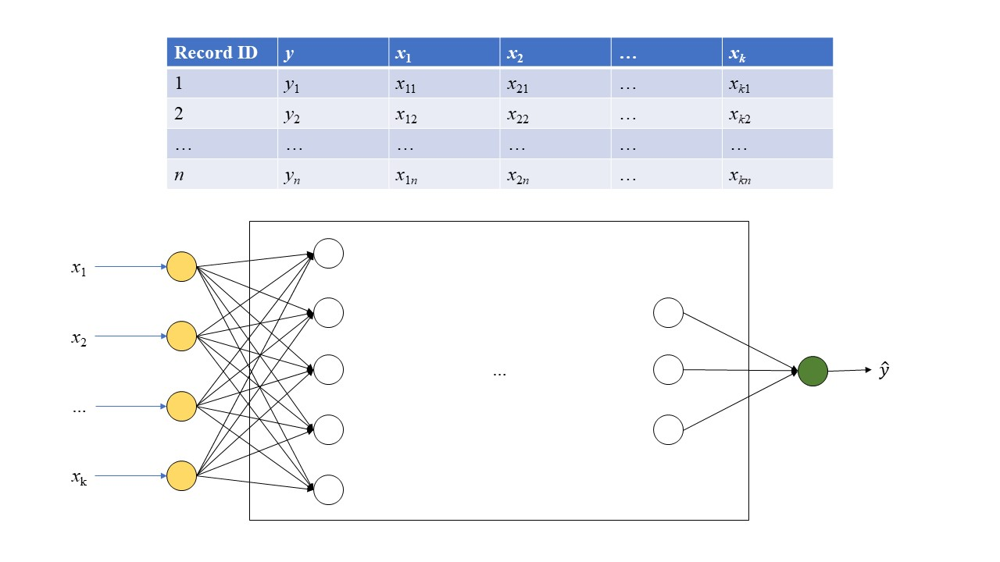
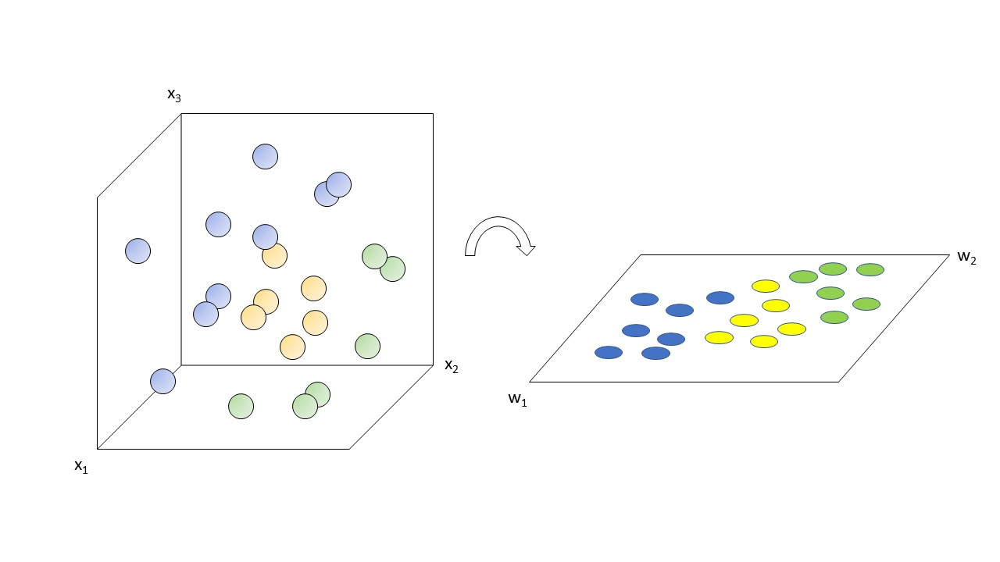
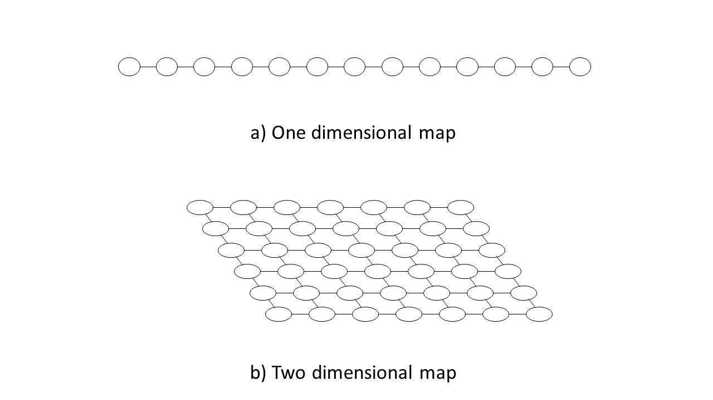
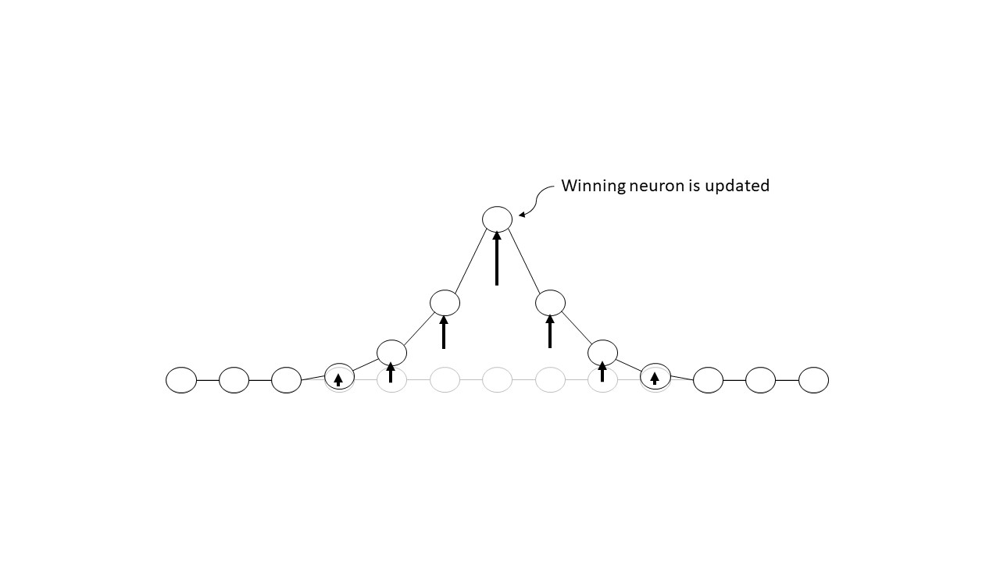

# Introduction

In previous sessions we have considered artificial neural networks with a few different network architectures. The architecture of the network is one of the most important aspects of developing a model based on the neural network approach. For instance, _multilayer perceptron networks_ (MPN) consist of one input layer, one or more hidden layers, and one output layer. _Convolutional neural networks_ use a different architecture that is suitable for multi-channel, multi-dimensional data, such as images.

A common aspect of these networks is the way they learn.

If we recall the architecture of networks of this type, they are in general terms as seen in Figure 1. 




Figure 1 is a schematic only, since the input layer in a convolutional neural network will not be a dense layer, but a data convolution. Nonetheless, at the end of the network, the output is always an estimate of a known value, irrespective of whether the inputs are images (in the case of convolutional neural networks) or tabular data (in the case of multiperceptron networks). For instance, in handwritting recognition, the output will be a probability that the input is of a certain class (say, a digit between 0 and 9). In spatial interpolation it will be an estimated value of an observation.

As seen in Figure 1, the network is trained on the data $x$ with the objective of producing an estimated value of $y$, say $\hat{y}$, that will minimize a loss function.

Training of these networks involves feeding data forward across the network, and then backpropagating the error to adjust the parameters of the model. In this way, we have worked with neural networks in a _supervised learning_ context.

There are classes of problems, on the other hand, that are not amenable to supervised learning approaches. Classification, for instance, is an important problem where there are no "outcomes" that can be used to train a model.

You might be already familiar with a number of classifications approaches when the "labels" or "outcomes" of the observations are not known, but want to be retrieved from the data. These include clustering algorithms such as k-means, k-modes, hierarchical clustering, etc. The idea behind these algorithms is to arrange inputs according to their similarity, and are therefore also considered dimensional reduction techniques: by reducing multiple dimensions to only one or two it becomes possible to visualy inspect relationships in complex datasets.



The objective of this seminar is to introduce an artificial neural network architecture used for dimension reduction and classification in an unsupervised learning context, the Self Organizing Map.

# The Self Organizing Map

The concept of Self Organizing Maps is due to T. Kohonen circa 1981. The architecture of the network is either a string of neurons for one dimensional maps, or a tesselation of neurons for two dimensional maps (see Figure 3). 



In theory, higher dimensional maps are possible, although they defeat the purpose of providing a visually convenient representation of similiraties among the inputs.

Each of the cells in a map, like other neural networks, contains a set of parameters or _weights_. At first glance, the Self Organizing Map may resemble a convolutional neural network. This is only a superficial similarity.

The inputs for a Self Organizing Map are tabular data of the form:
$$
\textbf{x}_i=[x_{i1}, x_{i2},...,x_{ik}],
$$
where $\textbf{x}$ is a vector of size $1\times k$.

Similar to feeding the data in batches to a feedback neural network, inputs are passed on to a Self Organizing Map in sequential fashion, in principle with a batch size of one, although larger batches are possible too [Kohonen, 1998](https://www.sciencedirect.com/science/article/pii/S0925231298000307).

Each input is fed to every neuron in the network. Each neuron has as many weights as there are variables in the input vector, in other words, neuron $n$ has weights:
$$
\textbf{w}_n=[w_{n1}, w_{n2},...,w_{nk}].
$$

Self Organizing Maps learn based on a competition protocol. Each time an input is fed to the network, the neurons in the network compete for it using a discrimination function. A natural candidate for a discriminant function is the Euclidean distance between the neuron and the input:
$$
d_{in} = \sqrt{(x_{i1}-w_{n1})^2+(x_{i1}-w_{n1})^2+...+(x_{i1}-w_{n1})^2}
$$

The neuron that is most similar to the input (i.e., the one with the smallest distance to the input) becomes the winner, and it adjusts its parameters (weights) to further increase its similartiy to the input.

Here I want to illustrate the mechanics for creating SOMs.

# A simple one dimensional map and initialization

Lets begin by clearing the workspace.
```{r}
rm(list = ls())
```

Next, we load the packages that are used in this document:
```{r}
library(tidyverse) # Easily Install and Load the 'Tidyverse'
library(plotly) # Create Interactive Web Graphics via 'plotly.js'
```

And then we proceed to create a sample data set:
```{r}
no <- 75
y <- 4 * runif(no, min = 0, max = 0.2)
z <- 1 - y + runif(no, min = 0, max = 0.1)
df <- data.frame(y = y, z = z, map = NA)
```

This dataset has seventy-five observations of $k=2$ stochastic variables `y` and `z`.

The first step in working with a Self Organizing Map is to create a feature map.

As mentioned above, the map can be one-, two-, or higher-dimensional, although in practice two-dimensional maps are the most common. Although there is little practical advantage to creating a one-dimensional map, in this case it makes visualization of the key mechanics of a Self Organizing Map easier, so we will create a simple one-dimensional feature map.

A useful way to think about a Self Organizing Map is as a maleable string (in one dimension) or sheet (in two dimensions). The initial map does not have an even surface, but is instead "bumpy". The bumps are created by a random initialization of the weights.

A quantitative guideline to select the number of cells N in a map as a function of the number of observations $n$:
$$
N=5\sqrt{n}
$$

This means that larger samples require bigger maps, as seen below:
```{r}
f <- ggplot(data.frame(x = c(0, 1000)), aes(x))
size <- function(x) {5 * sqrt(x)}
f + stat_function(fun = size)
```

A large number of neurons enhances the ability of the map to adapt to the input; however, it also increases the probability of "blank" neurons, that is, neurons that do not classify any of inputs. A small number of blank neurons is to be expected, but a large number of blank neurons is indicative of inefficient size and may make classification problematic.

Here, we create and initialize a map with $N = 35$ neurons. 

Since each input consists of $k=2$ variables the neurons are initialized with the same number of weights, so that attached to each neuron there are values `w1` and `w2`. These values are initialized to a small random number:
```{r}
set.seed(19)
SOM <- data.frame(x = c(1:35), w1 = runif(35, min = 0.1, max = 0.9), w2 = runif(35, min = 0.1, max = 0.9), t = factor(1))
```

We can now visualize the initial network. To plot the neurons, we utilize their position in the network (their index $n$) for the x-axis, and a summary of their weights, essentially their distance from an arbitrary point (say zero):
```{r}
ggplot(data = SOM, aes(x = x, y = sqrt(w1^2 + w2^2))) +
  geom_line() +
  geom_point(aes(color = sqrt(w1^2 + w2^2)), shape = 16, size = 10) +
  geom_point(color = "black", shape = 1, size = 10)  +
  scale_color_distiller(palette = "Spectral")
```

As seen above, the map is a string of neurons with initial random values for weights.

# Feeding inputs and competition

The inputs are fed sequentially to the network. This can be done by drawing an observation at random and without replacement from the dataset, or if the data are not sorted in any obvious way, by feeding observation $i=1$, followed by $i=2$, and so on until all observations available for training have been used.

For this example, we will feed the observations in order from 1 to 75.

To feed the first input, we select the first observation in the dataset and use the weights to calculate the discriminant function:
```{r}
count <- 0
count <- count + 1
D <- sqrt((SOM$w1 - df$y[count])^2 + (SOM$w2 - df$z[count])^2)
```

Notice that `D` is simply the Euclidean distance between the observation and the weights of the neuron. The winning neuron is the one closest to the input, presently:
```{r}
paste("The node closest to this input observation is", which.min(D), "with a distance D of", format(min(D), digits = 3))
df$map[count] <- which.min(D)
```

# Updating the weights and topological dependency of neurons

Once that the winning neuron has been identified, the weights can be updated.

A possible updating mechanis is as folows.

Calculating a new set of weights (say, the weights at $t+1$) by adjusting the current weights (say, the weights at $t$) with the difference between the current weights and the input:
$$
\textbf{w}_{n}(t+1)=\textbf{w}_{n}(t)+(\textbf{x}_i(t)-\textbf{w}_{n}(t))
$$

By reducing their distance, the neuron and the input become _more similar_.

The above mechanism applies to the winning neuron. Unlike neurons in a feedforward network that do not interact cotemporaneously (a neuron receives information from neurons in a preceding layer, and sends information to neurons in a subsequent layer), neurons in a Self Organizing Map display a property of _topological dependency_.

What this means is that neurons in the map can influence each other. This is illustrated in Figure 4.



When the winning neuron is updated, other neurons in the map are updated too, but perhaps at a rate that decreases with increasing distance from the winning neuron. Thinking again of the map as a maleable surface, a neuron that adapts to more closely resemble its input will "pull" with it its neighbors, just like what would happen if you pressed or pulled a point on a rubber sheet.

The updating mechanism needs to be modified to capture this effect:
$$
\textbf{w}_{n}(t+1)=\textbf{w}_{n}(t)+h(\rho)(\textbf{x}_i(t)-\textbf{w}_{n}(t)).
$$

The updating mechanism is applied to every neuron on the map at time t, but the magnitude of the adjustment $(\textbf{x}_i(t)-\textbf{w}_{n}(t))$ is a function $h$ of the distance $\rho$ between the winning neuron and the neuron being updated.

Function $h()$ needs to be a monotonically decreasing function of distance $\rho$ to ensure a dampening effect on the adjustments to the weights. A candidate function is the negative exponential, for example:
$$
h(\rho)=exp(-\frac{\rho}{2})
$$

To implement the updating procedure in the example we need to calculate the distance of all neurons to the winning neuron (i.e., $\rho$):
```{r}
rho <- sqrt((which.min(D) - seq(1, 35))^2)
rho
```

The vector of distances that we calculated above defines the neighborhood of the winning neuron:
```{r}
ggplot(data = data.frame(x = c(1:35), rho = rho), aes(x = x, y = exp(-rho^2/2))) +
  geom_line() +
  ylab("h(rho)")
```

We can see from the plot above that the winning neuron will be fully adjusted by $(\textbf{x}_i(t)-\textbf{w}_{n}(t))$, whereas neurons at a distance of $\rho = 1$ unit away will be adjusted by only `r format(exp(-1/2), digits = 3)` of the difference between the weights and the inputs, and so on.

We now proceed to update the weights:
```{r}
w1 <- subset(SOM, t == as.character(count))$w1 + exp(-rho^2/2)*(y[count] - subset(SOM, t == as.character(count))$w1)
w2 <- subset(SOM, t == as.character(count))$w2 + exp(-rho^2/2)*(z[count] - subset(SOM, t == as.character(count))$w2)
SOM <- rbind(SOM, data.frame(x = c(1:35), w1 = w1, w2 = w2, t = factor(count + 1)))
```

If we plot again the map, we can see how it has updated:
```{r}
ggplot(data = subset(SOM, t == as.character(count + 1)), aes(x = x, y = sqrt(w1^2 + w2^2))) +
  geom_line() +
  geom_point(aes(color = sqrt(w1^2 + w2^2)), shape = 16, size = 10) +
  geom_point(color = "black", shape = 1, size = 10)  +
  scale_color_distiller(palette = "Spectral")
```

# Competition and updating

The training process continues by feeding the _next_ observation in the dataset to the network:
```{r}
count <- count + 1
D <- sqrt((subset(SOM, t == as.character(count))$w1 - df$y[count])^2 + (subset(SOM, t == as.character(count))$w2 - df$z[count])^2)
paste("The node most closely resembling this observation is", which.min(D), "with a distance D of", format(min(D), digits = 3))
df$map[count] <- which.min(D)
```

We again calculate the distance of all neurons to the winning neuron:
```{r}
rho <- sqrt((which.min(D) - seq(1, 35))^2)
rho
```

And update the weights:
```{r}
w1 <- subset(SOM, t == as.character(count))$w1 + exp(-rho^2/2)*(y[count] - subset(SOM, t == as.character(count))$w1)
w2 <- subset(SOM, t == as.character(count))$w2 + exp(-rho^2/2)*(z[count] - subset(SOM, t == as.character(count))$w2)
SOM <- rbind(SOM, data.frame(x = c(1:35), w1 = w1, w2 = w2, t = factor(count + 1)))
ggplot(data = subset(SOM, t == as.character(count + 1)), aes(x = x, y = sqrt(w1^2 + w2^2))) +
  geom_line() +
  geom_point(aes(color = sqrt(w1^2 + w2^2)), shape = 16, size = 10) +
  geom_point(color = "black", shape = 1, size = 10)  +
  scale_color_distiller(palette = "Spectral")
```

# Completing the training process

It is straightforward to loop the rest of the training procedure:
```{r}
for(count in 3:nrow(df)){
  # Pick the _next_ observation in the dataset and compare to the weights
  D <- sqrt((subset(SOM, t == as.character(count))$w1 - df$y[count])^2 + (subset(SOM, t == as.character(count))$w2 - df$z[count])^2)

  # Assign observation to node on map  
  df$map[count] <- which.min(D)
  
  # Calculate distance of all neurons to the winning neuron (call this $\rho$)
  rho <- sqrt((which.min(D) - seq(1, 35))^2)
  
  # Update the weights
  w1 <- subset(SOM, t == as.character(count))$w1 + exp(-rho^2/2)*(y[count] - subset(SOM, t == as.character(count))$w1)
  w2 <- subset(SOM, t == as.character(count))$w2 + exp(-rho^2/2)*(z[count] - subset(SOM, t == as.character(count))$w2)
  SOM <- rbind(SOM, data.frame(x = c(1:35), w1 = w1, w2 = w2, t = factor(count + 1)))
}
```

We can inspect the process by creating a `plotly` animation (more about `plotly [here](https://plot.ly/r/getting-started/)):
```{r}
p <- ggplot(data = SOM, aes(x = x, y = sqrt(w1^2 + w2^2))) +
  geom_line(aes(frame = t)) +
  geom_point(aes(color = sqrt(w1^2 + w2^2), frame = t), shape = 16, size = 5) +
  scale_color_distiller(palette = "Spectral")
p <- ggplotly(p)
p
```

The animation shows how the map has "self organized" in response to the inputs. If we compare initial map to final map:
```{r}
ggplot() +
  geom_line(data = subset(SOM, t == as.character(no)), aes(x = x, y = sqrt(w1^2 + w2^2))) +
  geom_point(data = subset(SOM, t == as.character(no)), aes(x = x, y = sqrt(w1^2 + w2^2), color = sqrt(w1^2 + w2^2)), shape = 16, size = 10) +
  geom_point(data = subset(SOM, t == as.character(no)), aes(x = x, y = sqrt(w1^2 + w2^2)), color = "black", shape = 1, size = 10) +
  geom_line(data = subset(SOM, t == as.character(1)), aes(x = x, y = sqrt(w1^2 + w2^2)), alpha = 0.3) +
  geom_point(data = subset(SOM, t == as.character(1)), aes(x = x, y = sqrt(w1^2 + w2^2)), color = "black", shape = 1, size = 10, alpha = 0.3) +
  scale_color_distiller(palette = "Spectral")
```

So the map has organized, and the observations have been classified, in the sense that they have been assigned to a neuron as part of the training process. Clearly, more similar observations will have been assigned to neighboring neurons (since they will themselves be more similar among them),  and possibly the same neuron.

Since in this example the inputs consisted only of two variables, it is possible to visualize them directly. The following plot of the inputs gives a sense of how well this procedure classified the observations:
```{r}
ggplot(data = df, aes(x = y, y = z)) + 
  geom_point(aes(color = sqrt(y^2 + z^2)), size = 5) +
  geom_point(size = 5, shape = 1) + 
  scale_color_distiller(palette = "Spectral")
  theme(legend.position = "bottom")
```

# Time-dependent parameters

The updating mechanism introduced above allows the map to remain equally malleable throughout the whole training exercise. A modified version of the updating mechanism introduces time-dependent parameters that reduce the malleability of the map as the training exercise advances.

This version of the updating mechanism is as follows:
$$
\textbf{w}_{n}(t+1)=\textbf{w}_{n}(t)+\alpha(t)h(\rho t)(\textbf{x}_i(t)-\textbf{w}_{n}(t))
$$

In the equation above, the topological control $h()$ becomes a function of, in addition of distance to the winning neurone, the training period $t$. For example:
$$
h(\rho t)=exp\Big(-\frac{\rho}{2\sigma(t)}\Big),
$$
where $\sigma(t)$ is also a monotonically decreasing function, such as:
$$
\sigma(t)=exp\Big(-\frac{t}{n}\Big)
$$
so the function grows smaller as t increases. The effect of this parameter is to make the size of the neighborbood smaller over time:
```{r}
f <- ggplot(data.frame(x = c(-10, 10)), aes(x))
h <- function(x) {exp(-x^2/50)}
f + stat_function(fun = h)
```

The second modification to the updating mechanism is the introduction of a _learning rate_ function $\alpha\$. This function is also time-dependent, and could be as follows:
$$
\alpha(t)=\alpha_0\Big(1-\frac{t}{n}\Big)
$$
As $t$ increases, the learning rate declines, in effect making later adjustments to the weights smaller.

Let try again training a map but now with time-dependent dampening parameters.

We'll first reset the data:
```{r}
set.seed(19)
SOM2 <- data.frame(x = c(1:35), w1 = runif(35, min = 0.1, max = 0.9), w2 = runif(35, min = 0.1, max = 0.9), t = factor(1))
```

We also recreate sample dataset:
```{r}
no <- 75
y <- 4 * runif(no, min = 0, max = 0.2)
z <- 1 - y + runif(no, min = 0, max = 0.1)
df2 <- data.frame(y = y, z = z, map = NA)
```

Here we train a new map with time-dependent parameters:
```{r}
for(count in 1:no){
  # Pick the _next_ observation in the dataset and compare to the weights
  D <- sqrt((subset(SOM2, t == as.character(count))$w1 - df2$y[count])^2 + (subset(SOM2, t == as.character(count))$w2 - df2$z[count])^2)

  # Assign observation to node on map  
  df2$map[count] <- which.min(D)
  
  # Calculate distance of all neurons to the winning neuron (call this $\rho$)
  rho <- sqrt((which.min(D) - seq(1, 35))^2)
  
  # Update the weights
  w1 <- subset(SOM2, t == as.character(count))$w1 + 0.9 * (1 - count/no) * exp(-rho^2/(2 * exp(-count/no)))*(df2$y[count] - subset(SOM2, t == as.character(count))$w1)
  w2 <- subset(SOM2, t == as.character(count))$w2 + 0.9 * (1 - count/no) * exp(-rho^2/(2 * exp(-count/no)))*(df2$z[count] - subset(SOM2, t == as.character(count))$w2)
  SOM2 <- rbind(SOM2, data.frame(x = c(1:35), w1 = w1, w2 = w2, t = factor(count + 1)))
}
```

Lets inspect the training procedure:
```{r}
p <- ggplot(data = SOM2, aes(x = x, y = sqrt(w1^2 + w2^2))) +
  geom_line(aes(frame = t)) +
  geom_point(aes(color = sqrt(w1^2 + w2^2), frame = t), shape = 16, size = 5) +
  scale_color_distiller(palette = "Spectral")
p <- ggplotly(p)
p
```

Compare the initial maps to the final maps.
```{r}
SOMs <- rbind(SOM, SOM2)
SOMs$som <- as.factor(rep(c("SOM1", "SOM2"), each = 2660))
ggplot(SOMs) +
  geom_line(data = subset(SOMs, t == as.character(no)), aes(x = x, y = sqrt(w1^2 + w2^2))) +
  geom_point(data = subset(SOMs, t == as.character(no)), aes(x = x, y = sqrt(w1^2 + w2^2), color = sqrt(w1^2 + w2^2)), shape = 16, size = 10) +
  geom_point(data = subset(SOMs, t == as.character(no)), aes(x = x, y = sqrt(w1^2 + w2^2)), color = "black", shape = 1, size = 10) +
  geom_line(data = subset(SOMs, t == as.character(1)), aes(x = x, y = sqrt(w1^2 + w2^2)), alpha = 0.3) +
  geom_point(data = subset(SOMs, t == as.character(1)), aes(x = x, y = sqrt(w1^2 + w2^2)), color = "black", shape = 1, size = 10, alpha = 0.3) +
  scale_color_distiller(palette = "Spectral") +
  facet_grid(.~ som) +
  theme(legend.position = "bottom")
```

What difference do you notice? What is a possible advantage of introducing time-dampening parameters in the training algorithm?

With this we have covered the basic mechanics of Self Organizing Maps. In the following sessions we will expand this to two dimensional maps and we will see practical applications.
